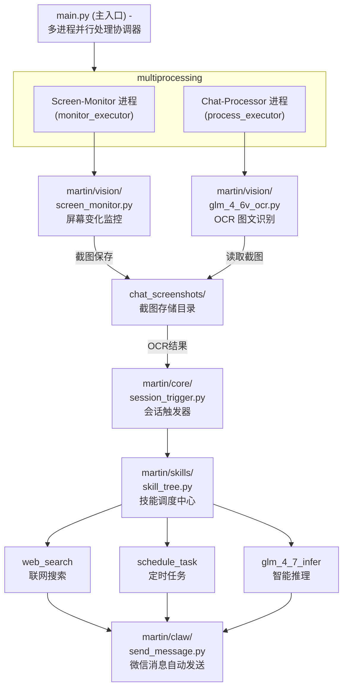

# Martinbot - A Vision-Based WeChat Group Chat Assistant

<div align="center">


**超能马丁：一个基于视觉的微信群聊助手**

<p>
  <a href="https://www.python.org/"></a>
  <a href="LICENSE"></a>
</p>

</div>

---

## 📖 目录

- [项目简介](#项目简介)
- [核心功能](#核心功能)
- [系统架构](#系统架构)
- [环境要求](#环境要求)
- [快速开始](#快速开始)
- [配置说明](#配置说明)
- [模块详解](#模块详解)
- [技能系统](#技能系统)
- [常见问题](#常见问题)

---

## 项目简介

Martinbot 是一个智能微信群聊助手，通过屏幕监控、OCR识别、大模型推理和GUI自动化实现自动回复功能。系统采用多进程并行架构，支持联网搜索、定时任务等高级技能。

### 核心特性

- 🖥️ **屏幕监控** - 实时检测微信聊天区域变化
- 👁️ **OCR识别** - 使用 GLM-4.6V 视觉模型识别聊天内容
- 🧠 **智能推理** - 基于 GLM-4.7 的多轮对话与工具调用
- 🔧 **技能系统** - 联网搜索、定时提醒、自动任务
- 📜 **上下文管理** - 滑动窗口历史记录，保持对话连贯
- 🎭 **每日身份** - 365天不重复的马丁身份设定

---

## 核心功能

| 功能模块 | 说明 |
|----------|------|
| **Screen-Monitor** | 持续监控指定屏幕区域，检测变化并保存截图 |
| **Chat-Processor** | 处理截图、OCR识别、会话触发、智能回复 |
| **Web Search** | 联网搜索实时信息（新闻、天气、股价等） |
| **Schedule Task** | 定时提醒与自动任务执行 |
| **Identity System** | 每日随机身份，增加趣味性 |

---

## 系统架构



---

## 环境要求

- **Python**: 3.11+
- **操作系统**: Windows (依赖 pyautogui GUI自动化)
- **微信**: 桌面版客户端

---

## 快速开始

### 1. 克隆项目

```bash
git clone https://github.com/Levitan911/Martinbot.git
cd Martinbot
```

### 2. 安装依赖

推荐使用 [uv](https://docs.astral.sh/uv/) 作为包管理器：

```bash
# 安装 uv
powershell -ExecutionPolicy ByPass -c "irm https://astral.sh/uv/install.ps1 | iex"

# 创建虚拟环境并安装依赖
uv sync
```

或使用 pip：

```bash
pip install -r requirements.txt
```

### 3. 配置 API 密钥

编辑 `conf/config.yaml`，填入你的 API 密钥：

```yaml
martin:
  vision:
    DEFAULT_API_KEY: "your-zhipu-api-key"  # 智谱AI API密钥
  
  mind:
    DEFAULT_API_KEY: "your-zhipu-api-key"  # 智谱AI API密钥
  
  skills:
    FIRECRAWL_API_KEY: "your-firecrawl-api-key"  # Firecrawl搜索API
```

### 4. 初始化坐标定位

首次运行需要定位微信界面坐标：

```powershell
uv run .\martin\equipments\wechat_locator.py
```

按照提示依次点击：
1. **微信会话显示区左上角** ↖
2. **微信会话显示区右下角** ↘
3. **微信聊天输入区**

### 5. 唤醒马丁

```bash
uv run main.py
```

### 6. 停止运行

按 `Ctrl+C` 停止所有进程

---

## 配置说明

配置文件位于 `conf/config.yaml`：

```yaml
martin:
  # 通用配置
  general:
    SCREENSHOTS_DIR: "chat_screenshots"    # 截图存储目录
    CHECK_INTERVAL: 3                      # 检查间隔(秒)
    KEYWORD: "@马丁"                       # 触发关键词
    LLM: "glm-4.7"                         # 推理模型

  # 视觉模块
  vision:
    DIFFERENCE_THRESHOLD: 1099             # 屏幕变化阈值
    SAVE_IMAGES: true                      # 是否保存截图
    DEFAULT_MODEL: "glm-4.6v-flash"        # OCR模型

  # 核心模块
  core:
    sliding_window_size: 15                # 上下文滑动窗口大小

  # 认知模块
  mind:
    DEFAULT_MODEL: "glm-4.7-flash"         # 推理模型

  # 技能模块
  skills:
    DB_URL: "sqlite:///martin_tasks.db"    # 任务数据库
```

---

## 模块详解

### 目录结构

```
Martinbot/
│
├── main.py                          # 主入口
├── conf/
│   ├── config.yaml                  # 配置文件
│   └── settings.py                  # 配置加载器
│
├── martin/                          # 六大模块
│   ├── vision/                      # 视觉模块
│   │   ├── screen_monitor.py        # 屏幕监控
│   │   └── glm_4_6v_ocr.py          # OCR识别
│   │
│   ├── core/                        # 核心模块
│   │   ├── session_trigger.py       # 会话触发
│   │   ├── chat_merger.py           # 聊天合并
│   │   └── chat_parser.py           # 聊天解析
│   │
│   ├── mind/                        # 认知模块
│   │   ├── glm_4_7_infer.py         # 智能推理
│   │   └── extract_identity.py      # 身份提取
│   │
│   ├── skills/                      # 技能模块
│   │   ├── skill_tree.py            # 技能调度
│   │   ├── web_search.py            # 联网搜索
│   │   └── schedule_task.py         # 定时任务
│   │
│   ├── claw/                        # 操作模块
│   │   └── send_message.py          # 消息发送
│   │
│   └── equipments/                  # 装备模块
│       ├── wechat_locator.py        # 坐标定位
│       ├── logging_config.py        # 日志配置
│       └── fix_json_str.py          # JSON修复
│
├── default_prompt_files/            # 提示词文件
│   ├── llm/
│   │   ├── martin_identities_365.csv    # 身份数据库
│   │   └── system_prompt_template.md    # 系统提示词
│   └── vlm/
│       └── user_prompt.md               # OCR提示词
│
├── chat_screenshots/                # 截图目录
├── dialog_info/                     # 对话数据
├── stickers/                        # 表情包
└── logs/                            # 日志文件
```

### 模块职责

| 模块 | 路径 | 职责 |
|------|------|------|
| **vision** | `martin/vision/` | 屏幕监控与OCR识别 |
| **core** | `martin/core/` | 聊天数据处理与会话触发 |
| **mind** | `martin/mind/` | 大模型推理与身份管理 |
| **claw** | `martin/claw/` | GUI自动化消息发送 |
| **equipments** | `martin/equipments/` | 工具函数与配置 |
| **skills** | `martin/skills/` | 技能系统（搜索、定时任务） |

---

## 技能系统

Martin 拥有以下核心技能：

### 🔍 联网搜索 (search_web)

当用户询问实时信息时自动调用：

```
User: @马丁 今天有哪些热点新闻？
User: @马丁 特斯拉股价多少？
User: @马丁 北京天气怎么样？
```

### ⏰ 定时任务 (schedule_task)

支持自然语言时间描述：

```
User: @马丁 半小时后提醒我开会
User: @马丁 明天晚上8点30提醒我收看直播
User: @马丁 每晚九点推送给我最新的AI科技资讯
```

**任务类型**：
- `reminder`: 简单提醒，到时直接发送消息
- `auto_action`: 自动任务，到时触发Bot执行指令

### 📋 任务管理

```
User: @马丁 我有什么待办事项？
User: @马丁 取消关于开会的提醒
```

---

## 数据流

```
微信聊天界面
     │
     │ 屏幕变化
     ▼
screen_monitor.py ──截图──▶ chat_screenshots/
     │
     │
     ▼
glm_4_6v_ocr.py ──OCR──▶ JSON聊天记录
     │
     │
     ▼
chat_parser.py ──解析──▶ DataFrame
     │
     │
     ▼
chat_merger.py ──合并──▶ chat_data.csv
     │
     │
     ▼
session_trigger.py ──触发──▶ session_cache
     │
     │
     ▼
skill_tree.py ──调度──▶ 工具调用
     │
     │
     ▼
glm_4_7_infer.py ──推理──▶ 回复内容
     │
     │
     ▼
send_message.py ──发送──▶ 微信聊天界面
```

---

## 常见问题

### Q: 截图是纯黑的？

**原因**: 多显示器环境下，监控区域坐标超出主显示器范围。

**解决**: 重新运行 `wechat_locator.py`，确保点击位置在主显示器范围内。

### Q: OCR 识别失败？

**可能原因**:
1. API 密钥无效或过期
2. 网络连接问题

**解决**: 检查 `conf/config.yaml` 中的 API 密钥配置。

---

## 依赖说明

| 库名 | 用途 |
|------|------|
| `zai-sdk` | 智谱AI SDK |
| `apscheduler` | 定时任务调度 |
| `firecrawl` | 网页搜索与抓取 |
| `pyautogui` | GUI自动化 |
| `pynput` | 鼠标监听 |
| `pyperclip` | 剪贴板操作 |
| `pandas` | 数据处理 |
| `sqlalchemy` | 数据库ORM |
| `PIL` | 图像处理 |
| `numpy` | 数值计算 |

---

## 许可证

[MIT License](LICENSE)

---

## 作者

**Gabriel Gao**

---

<div align="center">

*Made with ❤️ by Gabriel Gao*

</div>
